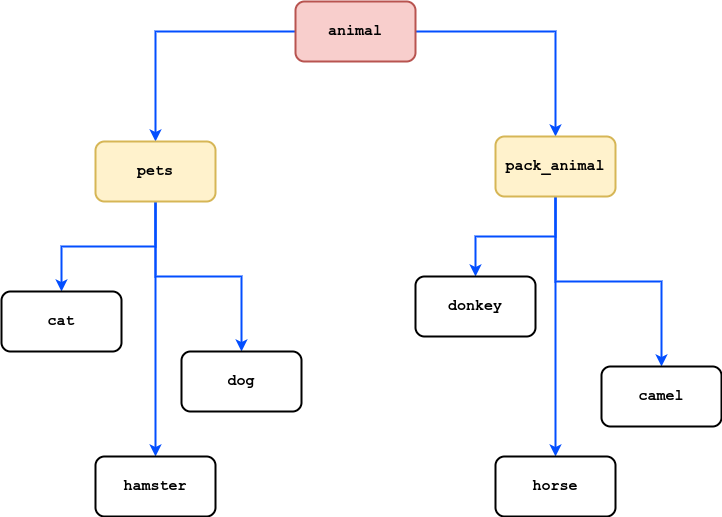

# control_work_practice

Итоговая контрольная работа по блоку специализация

Задание

1. Используя команду cat в терминале операционной системы Linux, создать два файла Домашние животные (заполнив файл собаками, кошками, хомяками) и Вьючные животными заполнив файл Лошадьми, верблюдами и ослы), а затем объединить их. Просмотреть содержимое созданного файла. Переименовать файл, дав ему новое имя (Друзья человека).
```shell
ilya@ilya-ROG-Strix-G513QY-G513QY:~/control_work_practice$ cat > pets
dog
cat
hamster

ilya@ilya-ROG-Strix-G513QY-G513QY:~/control_work_practice$ cat > pack_animal
cow
horse
donkey

ilya@ilya-ROG-Strix-G513QY-G513QY:~/control_work_practice$ cat pets pack_animal 
dog
cat
hamster
cow
horse
donkey

ilya@ilya-ROG-Strix-G513QY-G513QY:~/control_work_practice$ cat pets pack_animal > all_animals

ilya@ilya-ROG-Strix-G513QY-G513QY:~/control_work_practice$ cat all_animals 
dog
cat
hamster
cow
horse
donkey

ilya@ilya-ROG-Strix-G513QY-G513QY:~/control_work_practice$ mv all_animals mans_friends

```
2. Создать директорию, переместить файл туда.
```shell
ilya@ilya-ROG-Strix-G513QY-G513QY:~/control_work_practice$ mkdir tmpDir && mv mans_friends ./tmpDir
```
3. Подключить дополнительный репозиторий MySQL. Установить любой пакет из этого репозитория.
```shell
lesson@serverub:~$ wget https://repo.mysql.com//mysql-apt-config_0.8.25-1_all.deb
--2023-06-07 12:13:40--  https://repo.mysql.com//mysql-apt-config_0.8.25-1_all.deb
Resolving repo.mysql.com (repo.mysql.com)... 104.73.92.227
Connecting to repo.mysql.com (repo.mysql.com)|104.73.92.227|:443... connected.
HTTP request sent, awaiting response... 200 OK
Length: 18120 (18K) [application/x-debian-package]
Saving to: ‘mysql-apt-config_0.8.25-1_all.deb’

mysql-apt-config_0.8.25-1_all.deb                                    100%[====================================================================================================================================================================>]  17.70K  --.-KB/s    in 0s      

2023-06-07 12:13:40 (159 MB/s) - ‘mysql-apt-config_0.8.25-1_all.deb’ saved [18120/18120]

lesson@serverub:~$ sudo dpkg -i mysql-apt-config_0.8.25-1_all.deb 
[sudo] password for lesson: 
Selecting previously unselected package mysql-apt-config.
(Reading database ... 111014 files and directories currently installed.)
Preparing to unpack mysql-apt-config_0.8.25-1_all.deb ...
Unpacking mysql-apt-config (0.8.25-1) ...
Setting up mysql-apt-config (0.8.25-1) ...

lesson@serverub:~$ sudo apt install mysql-client
```
4. Установить и удалить deb-пакет с помощью dpkg.
```shell
sudo dpkg -i <deb-package_name>

sudo dpkg -r <deb-package_name> 
или
sudo dpkg -P <deb-package_name> # полное удаление
```
5. Выложить историю команд в терминале ubuntu
```shell
lesson@serverub:~$ history | tail
 1146  sudo systemctl start mysql
 1147  sudo systemctl start mysql-server
 1148  mysql --version
 1149  exit
 1150  sudo apt purge mysql-client
 1151  sudo shutdown -P now
 1152  sudo dpkg --help
 1153  history 
 1154  sudo history 
 1155  history | tail

```
6. Нарисовать диаграмму, в которой есть класс родительский класс, домашние животные и вьючные животные, в составы которых в случае домашних животных войдут классы: собаки, кошки, хомяки, а в класс вьючные животные войдут: Лошади, верблюды и ослы).

7. В подключенном MySQL репозитории создать базу данных “Друзья человека”
```sql
CREATE DATABASE mans_friends;

USE mans_friends;
```
8. Создать таблицы с иерархией из диаграммы в БД
```sql
CREATE TABLE animal_type (
	id_animal INT AUTO_INCREMENT PRIMARY KEY NOT NULL,
    animal_type VARCHAR(20) NOT NULL
);

CREATE TABLE pets_kind (
	id_pets INT AUTO_INCREMENT PRIMARY KEY NOT NULL,
    animal_kind VARCHAR(20) NOT NULL,
    animal_type INT NOT NULL,
    FOREIGN KEY (animal_type) REFERENCES animal_type (id_animal)
);

CREATE TABLE pack_animal_kind (
	id_pack_animal INT AUTO_INCREMENT PRIMARY KEY NOT NULL,
    animal_kind VARCHAR(20) NOT NULL,
    animal_type INT NOT NULL,
    FOREIGN KEY (animal_type) REFERENCES animal_type (id_animal)
);

CREATE TABLE dogs (
	id INT AUTO_INCREMENT PRIMARY KEY NOT NULL,
    name VARCHAR(30) NOT NULL,
    make_command VARCHAR(100),
    birthday DATE,
    animal_kind INT,
    FOREIGN KEY (animal_kind) REFERENCES pets_kind (id_pets)
);

CREATE TABLE cats (
	id INT AUTO_INCREMENT PRIMARY KEY NOT NULL,
    name VARCHAR(30) NOT NULL,
    make_command VARCHAR(100),
    birthday DATE,
	animal_kind INT,
    FOREIGN KEY (animal_kind) REFERENCES pets_kind (id_pets)
);

CREATE TABLE hamsters (
	id INT AUTO_INCREMENT PRIMARY KEY NOT NULL,
    name VARCHAR(30) NOT NULL,
    make_command VARCHAR(100),
    birthday DATE,
    animal_kind INT,
    FOREIGN KEY (animal_kind) REFERENCES pets_kind (id_pets)
);

CREATE TABLE horses (
	id INT AUTO_INCREMENT PRIMARY KEY NOT NULL,
    name VARCHAR(30) NOT NULL,
    make_command VARCHAR(100),
    birthday DATE,
    animal_kind INT,
    FOREIGN KEY (animal_kind) REFERENCES pack_animal_kind (id_pack_animal)
);

CREATE TABLE donkeys (
	id INT AUTO_INCREMENT PRIMARY KEY NOT NULL,
    name VARCHAR(30) NOT NULL,
    make_command VARCHAR(100),
    birthday DATE,
    animal_kind INT,
    FOREIGN KEY (animal_kind) REFERENCES pack_animal_kind (id_pack_animal)
);

CREATE TABLE camels (
	id INT AUTO_INCREMENT PRIMARY KEY NOT NULL,
    name VARCHAR(30) NOT NULL,
    make_command VARCHAR(100),
    birthday DATE,
    animal_kind INT,
    FOREIGN KEY (animal_kind) REFERENCES pack_animal_kind (id_pack_animal)
);
```
9. Заполнить низкоуровневые таблицы именами(животных), командами которые они выполняют и датами рождения
```sql
INSERT INTO animal_type (animal_type) VALUES 
	("Pets"),
    ("Pack animals")
;
INSERT INTO pets_kind (animal_kind, animal_type) VALUES 
	("Dogs", (SELECT id_animal FROM animal_type WHERE animal_type = "Pets")),
    ("Cats", (SELECT id_animal FROM animal_type WHERE animal_type = "Pets")),
    ("Hamsters", (SELECT id_animal FROM animal_type WHERE animal_type = "Pets"))
;
INSERT INTO pack_animal_kind (animal_kind, animal_type) VALUES 
	("Horses", (SELECT id_animal FROM animal_type WHERE animal_type = "Pack animals")),
    ("Camels", (SELECT id_animal FROM animal_type WHERE animal_type = "Pack animals")),
    ("Donkeys", (SELECT id_animal FROM animal_type WHERE animal_type = "Pack animals"))
;

INSERT INTO dogs (name, make_command, birthday, animal_kind) VALUES 
	("Bobik", "sitdown, voice", "2023-01-07", (SELECT id_pets FROM pets_kind WHERE animal_kind = "Dogs")),
    ("Bilbo", "sitdown, voice, eat", "2015-06-21", (SELECT id_pets FROM pets_kind WHERE animal_kind = "Dogs"))
;
INSERT INTO cats (name, make_command, birthday, animal_kind) VALUES 
	("Whiski", "sitdown, go to me", "2023-01-07", (SELECT id_pets FROM pets_kind WHERE animal_kind = "Cats")),
    ("Black", "sitdown, go to me, eat", "2015-06-21", (SELECT id_pets FROM pets_kind WHERE animal_kind = "Cats"))
;
INSERT INTO hamsters (name, make_command, birthday, animal_kind) VALUES 
	("Bobik", "lie", "2023-01-07", (SELECT id_pets FROM pets_kind WHERE animal_kind = "Hamster")),
    ("Bilbo", "lie, eat", "2015-06-21", (SELECT id_pets FROM pets_kind WHERE animal_kind = "Hamster"))
;
INSERT INTO horses (name, make_command, birthday, animal_kind) VALUES 
	("Bobik", "follow me, voice", "2023-01-07", (SELECT id_pack_animal FROM pack_animal_kind WHERE animal_kind = "Horses")),
    ("Bilbo", "follow me, voice, eat", "2015-06-21", (SELECT id_pack_animal FROM pack_animal_kind WHERE animal_kind = "Horses"))
;
INSERT INTO donkeys (name, make_command, birthday, animal_kind) VALUES 
	("Bobik", "follow me, voice", "2023-01-07", (SELECT id_pack_animal FROM pack_animal_kind WHERE animal_kind = "Donkeys")),
    ("Bilbo", "follow me, voice, eat", "2015-06-21", (SELECT id_pack_animal FROM pack_animal_kind WHERE animal_kind = "Donkeys"))
;
INSERT INTO camels (name, make_command, birthday, animal_kind) VALUES 
	("Bobik", "sitdown, follow me, voice", "2023-01-07", (SELECT id_pack_animal FROM pack_animal_kind WHERE animal_kind = "Camels")),
    ("Bilbo", "sitdown, follow me, voice, eat", "2015-06-21", (SELECT id_pack_animal FROM pack_animal_kind WHERE animal_kind = "Camels"))
;
```
10. Удалив из таблицы верблюдов, т.к. верблюдов решили перевезти в другой питомник на зимовку. Объединить таблицы лошади, и ослы в одну таблицу.
```sql
DROP TABLE camels;

SELECT * FROM horses UNION SELECT * FROM donkeys;
```
11. Создать новую таблицу “молодые животные” в которую попадут все животные старше 1 года, но младше 3 лет и в отдельном столбце с точностью до месяца подсчитать возраст животных в новой таблице
```sql
CREATE TABLE young_animal AS (
SELECT *, TIMESTAMPDIFF(MONTH, birthday, NOW()) AS ages
FROM 
	(SELECT name, make_command, birthday, p.animal_kind, a_t.animal_type FROM dogs AS d LEFT JOIN pets_kind AS p ON d.animal_kind = p.id_pets LEFT JOIN animal_type AS a_t ON p.animal_type = a_t.id_animal UNION
	SELECT name, make_command, birthday, p.animal_kind, a_t.animal_type FROM cats AS c LEFT JOIN pets_kind AS p ON c.animal_kind = p.id_pets LEFT JOIN animal_type AS a_t ON p.animal_type = a_t.id_animal UNION
	SELECT name, make_command, birthday, p.animal_kind, a_t.animal_type FROM hamsters AS h LEFT JOIN pets_kind AS p ON h.animal_kind = p.id_pets LEFT JOIN animal_type AS a_t ON p.animal_type = a_t.id_animal UNION
	SELECT name, make_command, birthday, pa.animal_kind, a_t.animal_type FROM horses AS h LEFT JOIN pack_animal_kind AS pa ON h.animal_kind = pa.id_pack_animal LEFT JOIN animal_type AS a_t ON pa.animal_type = a_t.id_animal UNION
	SELECT name, make_command, birthday, pa.animal_kind, a_t.animal_type FROM donkeys AS d LEFT JOIN pack_animal_kind AS pa ON d.animal_kind = pa.id_pack_animal LEFT JOIN animal_type AS a_t ON pa.animal_type = a_t.id_animal)
 AS tmp
 HAVING ages BETWEEN 12 AND 36);
```
12. Объединить все таблицы в одну, при этом сохраняя поля, указывающие на прошлую принадлежность к старым таблицам.
```sql
CREATE TABLE all_animals AS (SELECT name, make_command, birthday, p.animal_kind, a_t.animal_type FROM dogs AS d LEFT JOIN pets_kind AS p ON d.animal_kind = p.id_pets LEFT JOIN animal_type AS a_t ON p.animal_type = a_t.id_animal UNION
SELECT name, make_command, birthday, p.animal_kind, a_t.animal_type FROM cats AS c LEFT JOIN pets_kind AS p ON c.animal_kind = p.id_pets LEFT JOIN animal_type AS a_t ON p.animal_type = a_t.id_animal UNION
SELECT name, make_command, birthday, p.animal_kind, a_t.animal_type FROM hamsters AS h LEFT JOIN pets_kind AS p ON h.animal_kind = p.id_pets LEFT JOIN animal_type AS a_t ON p.animal_type = a_t.id_animal UNION
SELECT name, make_command, birthday, pa.animal_kind, a_t.animal_type FROM horses AS h LEFT JOIN pack_animal_kind AS pa ON h.animal_kind = pa.id_pack_animal LEFT JOIN animal_type AS a_t ON pa.animal_type = a_t.id_animal UNION
SELECT name, make_command, birthday, pa.animal_kind, a_t.animal_type FROM donkeys AS d LEFT JOIN pack_animal_kind AS pa ON d.animal_kind = pa.id_pack_animal LEFT JOIN animal_type AS a_t ON pa.animal_type = a_t.id_animal);
```
13. Создать класс с Инкапсуляцией методов и наследованием по диаграмме.
14. Написать программу, имитирующую работу реестра домашних животных. В программе должен быть реализован следующий функционал:
    1. Завести новое животное
    2. определять животное в правильный класс
    3. увидеть список команд, которое выполняет животное
    4. обучить животное новым командам
    5. Реализовать навигацию по меню
15. Создайте класс Счетчик, у которого есть метод add(), увеличивающий̆ значение внутренней̆ int переменной̆ на 1 при нажатие “Завести новое животное” Сделайте так, чтобы с объектом такого типа можно было работать в блоке try-with-resources. Нужно бросить исключение, если работа с объектом типа счетчик была не в ресурсном try и/или ресурс остался открыт. Значение считать в ресурсе try, если при заведения животного заполнены все поля.